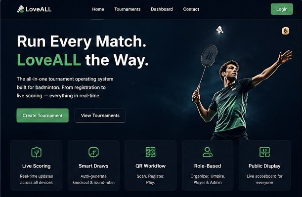
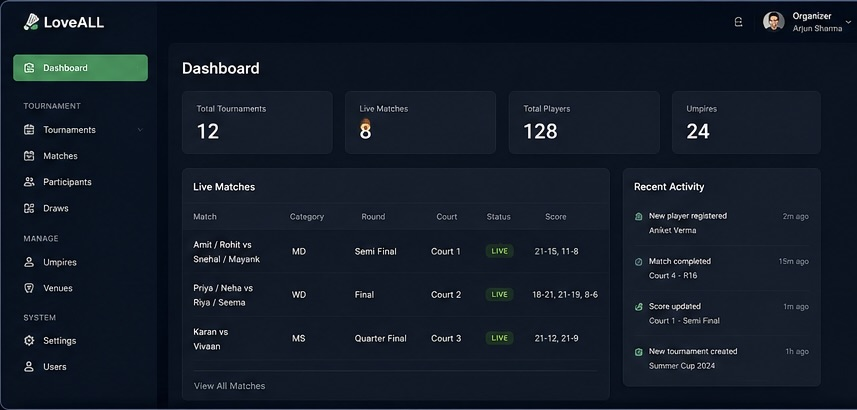
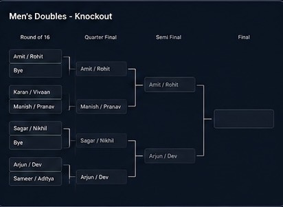
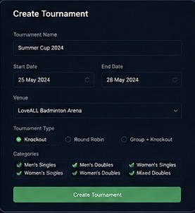
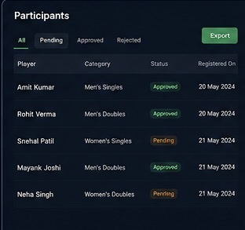
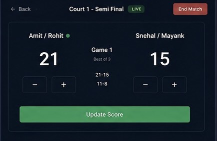
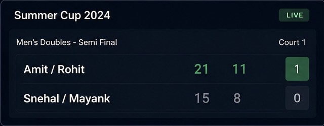
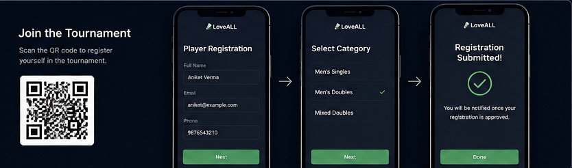

# 🏸 LoveALL — Badminton Tournament OS

<div align="center">



### ⚡ Run Every Match. LoveALL the Way.

A modern real-time badminton tournament operating system built for organizers, players, and umpires.

[]()
[]()
[]()
[]()

</div>

---

# ✨ Overview

LoveALL transforms chaotic badminton tournaments into a streamlined real-time digital experience.

From player registration to live scoreboards, everything runs in one synchronized ecosystem.

## 🎥 Product Preview

> Add your demo GIF here for a premium showcase feel.

```md

```

You can create a GIF using:

* Screen Studio (Mac)
* Kap
* OBS + EZGif
* Loom recordings

---

# 🚀 Core Features

## 📡 Real-Time Tournament Engine



* Live score synchronization
* Real-time match lifecycle updates
* Public display support
* Multi-device synchronization

---

## 🧠 Smart Match Generation



Automatically generate:

* Round Robin tournaments
* Knockout brackets
* Court allocations
* Match schedules

No spreadsheets. No manual management.

---

## 🎯 Tournament Creation System



Organizers can:

* Create tournaments instantly
* Configure categories
* Manage courts
* Control tournament flow
* Monitor live matches

---

## 👥 Participant Management



* QR-based player registration
* Approval workflow
* Category grouping
* Player tracking

---

## 🎤 Umpire Scoring Console



Built for speed during real matches.

* Scan QR → Start match
* Live score entry
* Instant synchronization
* Minimal distraction UI

---

## 📺 Live Public Scoreboard



A tournament-ready display mode for:

* TVs
* Projectors
* Public viewing screens

Scores update instantly across all devices.

---

## 📱 Join Tournament Flow



Players can:

* Scan QR codes
* Register instantly
* Select categories
* Join tournaments in seconds

---

# 🎮 Tournament Workflow

```text
Organizer Creates Tournament
            ↓
Players Register via QR
            ↓
Organizer Approves Participants
            ↓
Matches Generated Automatically
            ↓
Umpires Start Live Scoring
            ↓
Scores Sync Across All Screens
```

---

# 🛠️ Tech Stack

## Frontend

* React
* Tailwind CSS
* Framer Motion
* Socket.IO Client

## Backend

* Node.js
* Express.js
* Real-time APIs

## Database

* MongoDB

## Deployment

* Vercel
* Cloud Hosting

---

# 🔐 Architecture & Security

* Role-based API protection
* Secure tournament workflows
* Real-time socket synchronization
* Server-side validation
* Scalable SaaS-ready structure

---

# 🌍 Vision

LoveALL aims to become the infrastructure layer for badminton tournaments worldwide.

From local academies to professional competitions.

---

# 📈 Future Roadmap

* 📊 Analytics Dashboard
* 🤖 AI Match Predictions
* 🌐 Multi-language Support
* 🏟️ Large Tournament Scaling
* 📱 Mobile App

---

# 💡 Why This Project Matters

Most badminton tournaments still rely on:

* Manual score sheets
* WhatsApp coordination
* Spreadsheet management
* Delayed updates

LoveALL replaces that with a modern synchronized tournament operating system.

---

# 📌 Public Showcase Note

This repository is a public showcase version.

Core production logic, sensitive infrastructure, and backend services remain private.

---

# ❤️ Built For The Badminton Community

Players. Organizers. Umpires.

And the chaos of real tournaments.
